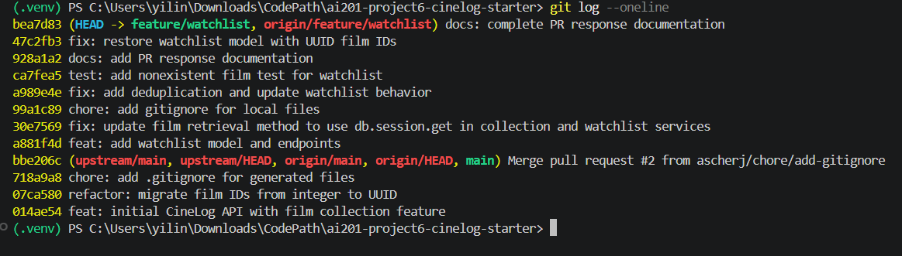

# PR Response Doc – CineLog Watchlist Feature

## AI Usage

(To fill out at the end.)

## Comment 1 – Rename

(To fill out.)

## Comment 2 – Deduplication

(To fill out.)

## Comment 3 – Missing test

(To fill out.)

## Comment 4 – Default visibility

**My position:**

I decided to keep `public=True` as the default.

**Reasoning:**

I think a public default makes the most sense for CineLog because the app is meant to be social. If someone is adding movies to a watchlist, it's probably because they want to keep track of what they're planning to watch, and sharing that with other users fits the purpose of the app. It also saves users from having to change the setting every single time they add a movie if they're okay with sharing it.

**Tradeoff acknowledged:**

I do understand why someone might prefer a private default. Some users may not want other people seeing their watchlist right away. The downside of using `public=True` is that those users would have to change the visibility themselves. Even so, I think a public default fits the overall goal of CineLog better, as long as users can easily change the setting whenever they want.

## Comment 5 – Sort order

**My position:**

I agree that the watchlist should be sorted by the date the movies were added, with the newest ones first.

**Reasoning:**

At first, the watchlist was sorted alphabetically, which makes it easy to find a specific movie by title. However, I think sorting by date added is more useful for how someone would normally use a watchlist. Users will probably want to see the movies they recently became interested in instead of searching through the whole list alphabetically.

**Engagement with the reviewer's point:**

The reviewer mentioned that most users would want to see what they added recently, and I agree with that reasoning. Alphabetical order is still useful, but it would make more sense as an optional sorting choice later instead of the default.

## Comment 6 – Rebase

## PR Description